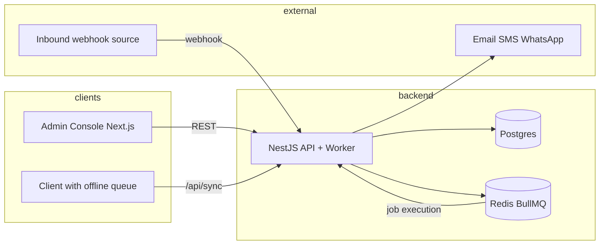
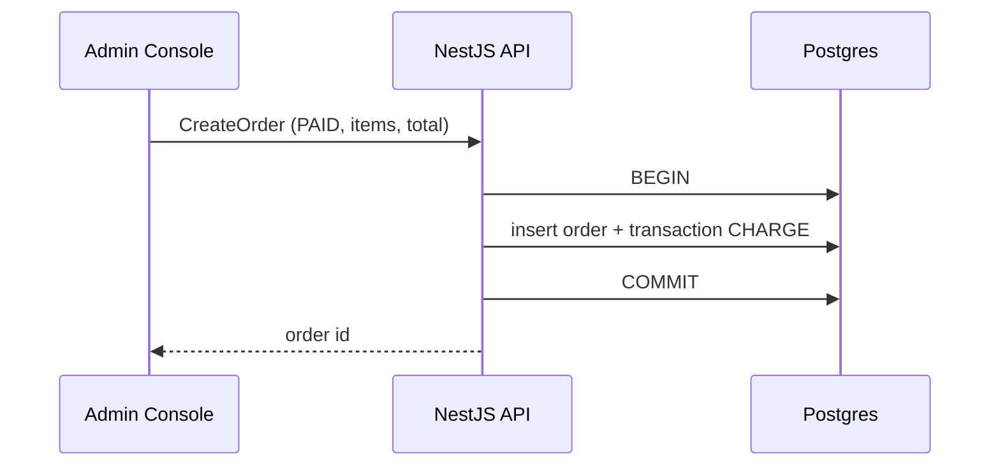
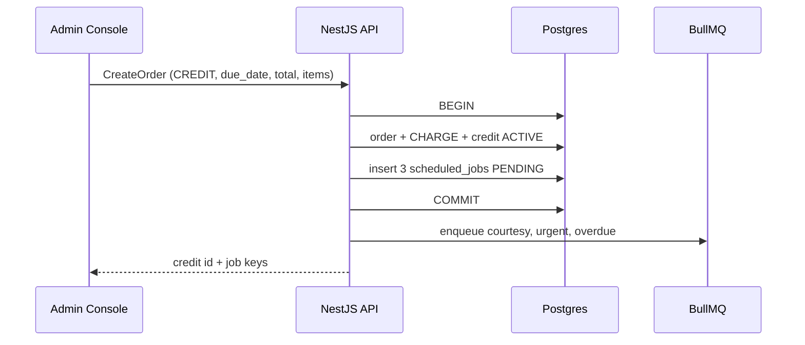
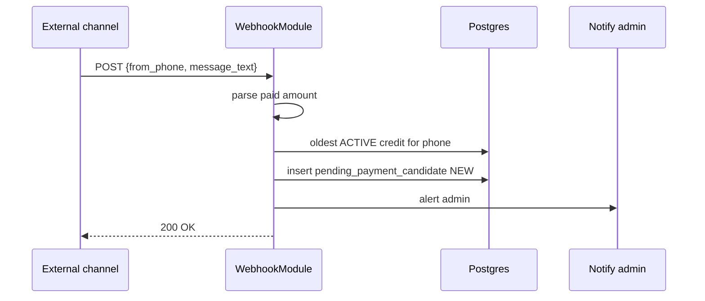

# Delicious24 — system architecture

This document describes components, flows, NestJS modules, DTOs, BullMQ contracts, and operational rules. **Canonical database shapes** live in [`packages/db/prisma/schema.prisma`](../packages/db/prisma/schema.prisma).

## Documentation map

| Doc | Use |
|-----|-----|
| [docs/README.md](./README.md) | Index of all docs; **resume** reading order. |
| [docs/SESSION_LOG.md](./SESSION_LOG.md) | Dated work log, **current repo state**, and **next steps** after each session. |
| [docs/DEVELOPMENT.md](./DEVELOPMENT.md) | Local setup, npm scripts, monorepo layout, doc-update conventions. |

Design and product rules stay in this file; operational and “where we left off” detail live in `SESSION_LOG.md` and `DEVELOPMENT.md`.

---

## High-level components

```
                    ┌──────────────────────────────────────────────────────────┐
                    │                     Observability                         │
                    │   Job dashboard · retry/failure alerts · audit viewer   │
                    └──────────────────────────────────────────────────────────┘
                                              ▲
┌─────────────┐   HTTPS/REST    ┌─────────────┴─────────────┐
│   Console   │ ──────────────► │         API (NestJS)       │
│ Next.js 14  │ ◄────────────── │  REST · webhooks · /sync   │
│ TypeScript  │                 │  + embedded worker process │
│  Admin UI   │                 └───────────┬────────────────┘
└─────────────┘                             │
      │                         ┌───────────┼───────────┐
      │                         ▼           ▼           ▼
      │                   ┌──────────┐ ┌────────┐ ┌─────────────┐
      │                   │ Postgres │ │ Redis  │ │ Notifications│
      │                   │ (SoT)    │ │BullMQ  │ │ Email/SMS/   │
      │                   │ + Prisma │ │Time    │ │ WhatsApp     │
      │                   └──────────┘ │Engine  │ └──────▲──────┘
      │                                └────────┘        │
      │                                     ▲            │
      └──────── offline queue ──────────────┼────────────┘
                          /api/sync (batched)    outbound sends
```

| Component | Responsibility |
|-----------|----------------|
| **Console** (Next.js 14, TypeScript) | Admin UI: search, customer ledger, create sale, pending payments queue, scheduled jobs dashboard, manual reminders, CSV export, audit viewer, reconciliation queue |
| **API** (NestJS) | Single monolith: REST for admin actions, webhook receiver, sync endpoint, worker process for jobs |
| **Database** (Postgres) | Source of truth: customers, menu, orders, credits, transactions, `scheduled_jobs`, `trust_score_events`, `audit_log`, pending payment candidates |
| **ORM** (Prisma) | Type-safe access and migrations (`packages/db`) |
| **Time engine** (Redis + BullMQ) | Delayed reminder jobs; metadata mirrored in `scheduled_jobs` for UI queries |
| **Notification adapters** | Outbound: Email, SMS, WhatsApp. Inbound: generic webhook with `from_phone` and `message_text` |
| **Client sync adapter** | Offline queue on client; `POST /api/sync` for batched reconciliation |
| **Observability** | Job dashboard, retry/failure alerts, audit log |

### System context (Mermaid)



---

## Primary sequence flows

### Create sale (PAID)

Admin creates order → single DB transaction creates `orders` + `transactions` (CHARGE) → no credit rows and no Bull jobs.



### Create sale (CREDIT)

Admin creates order → single DB transaction creates `orders` + `transactions` (CHARGE) + `credits` (principal, balance) → enqueue three delayed jobs in BullMQ and insert three rows in `scheduled_jobs`.



### Create sale (cash withdrawal)

Cash withdrawal is **not a separate order type** — it is recorded as a menu item on a PAID or CREDIT order. When a customer withdraws cash, the admin selects the "Cash Withdrawal" item (or any equivalent menu item), enters the withdrawal amount via item price, and adds a **charges** field for the service fee. The order total = withdrawal amount + charges. On credit, the customer owes the full total.

### Inbound message

Webhook receives `{ from_phone, message_text }` → parser extracts `paid <amount>` (case-insensitive) → create `pending_payment_candidate` linked to oldest **ACTIVE** credit for that customer → notify admin.



### Admin confirm payment

Admin confirms → single DB transaction creates `transactions` (PAYMENT), decrements `credits.balance`, updates `credits.status` (SETTLED when balance ≤ 0), cancels scheduled jobs, writes audit, triggers trust score event.

```mermaid
sequenceDiagram
  participant A as Admin Console
  participant API as NestJS API
  participant DB as Postgres
  participant Q as BullMQ
  participant T as TrustEngine

  A->>API: ConfirmPayment (amount, idempotency_key)
  API->>DB: idempotent check
  API->>DB: BEGIN
  API->>DB: PAYMENT; decrement balance; SETTLED if needed
  API->>DB: cancel scheduled_jobs; audit; trust_score_event
  API->>DB: COMMIT
  API->>Q: cancel delayed jobs as needed
  API->>T: apply delta + risk_segment
  API-->>A: updated ledger
```

### Job execution

Bull worker runs job → idempotency check → send notification → on success mark `scheduled_jobs` COMPLETED; on repeated failure mark FAILED and surface to admin.

```mermaid
sequenceDiagram
  participant W as WorkerModule
  participant DB as scheduled_jobs
  participant N as Notification adapter

  W->>DB: skip if COMPLETED/RUNNING same key+run_at
  W->>DB: RUNNING; attempts++
  W->>N: send
  alt success
    W->>DB: COMPLETED
  else failure
    W->>W: retry 1m, 5m, 20m (max 3)
    opt final failure
      W->>DB: FAILED + last_error
    end
  end
```

---

## NestJS module map

| Module | Role |
|--------|------|
| **AuthModule** | Minimal single-admin auth (optional) |
| **CustomersModule** | Search, CRUD, ledger endpoint |
| **MenuModule** | Menu items |
| **OrdersModule** | Create orders (PAID / CREDIT) |
| **CreditsModule** | Credit lifecycle, balance, due dates |
| **TransactionsModule** | CHARGE / PAYMENT / REFUND |
| **SchedulerModule** | Create/cancel jobs; `scheduled_jobs` mirror |
| **WebhookModule** | Inbound webhook parsing; pending payment candidates |
| **TrustEngineModule** | Trust deltas; `trust_score_events`; update `customers.trust_score` and `risk_segment` |
| **SyncModule** | Offline sync and reconciliation |
| **AuditModule** | Write/read `audit_log` |
| **WorkerModule** | BullMQ worker for job execution |

**Orchestration notes:** OrdersModule should coordinate CreditsModule, TransactionsModule, and SchedulerModule inside one DB transaction for CREDIT sales. WebhookModule resolves “oldest ACTIVE credit” via Customers/Credits. WorkerModule uses SchedulerModule, notification providers, and AuditModule for failure visibility.

---

## Key DTOs (shapes)

- **CreateOrderDTO** — `type`: PAID | CREDIT; `customer_id` (UUID, required); `items`: `{ menu_item_id, qty }[]` (required, min 1); `total` (decimal string); `due_date` (required for CREDIT); `note` (optional). Cash withdrawals are recorded as regular orders with a cash-withdrawal menu item plus a `note` or separate charges line item for the service fee.
- **CustomerSearchDTO** — `query` (phone, name, email); `page`, `limit`.
- **CustomerLedgerDTO** (response) — `customer`: `{ id, name, phone, email, trust_score, risk_segment }`; `credits[]`; `transactions[]`; `running_balance` (decimal).
- **InboundWebhookDTO** — `from_phone`, `message_text`, `raw_payload` (json).
- **ConfirmPaymentDTO** — `amount`; `note` (optional); `idempotency_key` (recommended).
- **ScheduledJobFilterDTO** — `credit_id` (optional); `status` (optional); `run_at_from`, `run_at_to` (optional).
- **SyncBatchDTO** — `client_id`; `changes`: `{ temp_id, entity_type, payload }[]`; `idempotency_key`.

---

## BullMQ job contract

**Job key format**

`credit:{credit_id}:reminder:{courtesy|urgent|overdue|manual}`

Manual jobs may include a time suffix, e.g. `credit:{uuid}:reminder:manual:2026-04-08T12:00:00`.

**Courtesy payload example**

```json
{
  "job_key": "credit:123e4567-e89b-12d3-a456-426614174000:reminder:courtesy",
  "credit_id": "123e4567-e89b-12d3-a456-426614174000",
  "customer_phone": "+2348012345678",
  "reminder_type": "COURTESY",
  "template_id": "courtesy_v1",
  "run_at": "2026-04-10T09:00:00"
}
```

**Idempotency key**

`job_key + ":" + run_at` (same `run_at` string as stored). Worker must consult `scheduled_jobs` and skip if already COMPLETED or RUNNING for the same logical send.

**Retry / backoff**

- Retries: **3** attempts.
- Backoff: **1 minute**, **5 minutes**, **20 minutes**.
- Final failure: `scheduled_jobs.status = FAILED`, populate `last_error`.

**Manual send example**

```json
{
  "job_key": "credit:123e4567-e89b-12d3-a456-426614174000:reminder:manual:2026-04-08T12:00:00",
  "credit_id": "123e4567-e89b-12d3-a456-426614174000",
  "customer_phone": "+2348012345678",
  "reminder_type": "MANUAL",
  "template_id": "manual_notice",
  "run_at": "2026-04-08T12:00:00"
}
```

---

## Data integrity, rounding, time, and offline

| Topic | Rule |
|--------|------|
| **Atomicity** | DB transactions for: order + credit + initial CHARGE; admin confirm payment (PAYMENT, balance, status, job cancel, audit/trust). Retry on serialization failures. |
| **Rounding** | Settlement normalization: floor to nearest major-unit ten (e.g. 2005 → 2000; 2000.5 → 2000; 180 → 180). Store amounts as `decimal(10,2)`; apply rule at settlement/display as documented in product. |
| **Time** | Store and display datetimes in **WAT** as naive local timestamps; schedule jobs using local times. Document API contract to avoid double offset when servers run in UTC. |
| **Offline sync** | Client uses temp UUIDs; server returns canonical IDs. Non-financial metadata: last-write-wins. Financial conflicts: server rejects and creates a reconciliation task for admin. |
| **Idempotency** | External mutating endpoints accept `idempotency_key`. Worker uses job idempotency as above. |

---

## Schema reference

Table and field definitions are implemented in Prisma: [`packages/db/prisma/schema.prisma`](../packages/db/prisma/schema.prisma).
